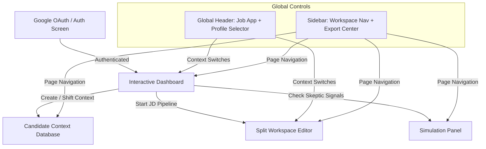

# EXHAUSTIVE UX/UI & WORKFLOW AUDIT REPORT
**System**: Multi-User Job Application Operating System (Resume OS)  
**Role**: Expert UX/UI Designer & Cognitive Psychologist  
**Focus**: Visual design, cognitive load, information architecture, workflow efficiency, and premium micro-interactions.

---

## Executive Summary
Resume OS represents a highly sophisticated, feature-rich workspace that bridges a massive technical capability gap—translating isolated candidate evidence, positioning rules, and job descriptions into five premium, recruiter-ready application outputs. The interface utilizes a modern **Obsidian Dark Mode** with high-contrast glowing accents and glassmorphic panels that immediately establish a technical, premium developer/product manager ecosystem.

This audit evaluates the entire system across **six core vectors**, identifying structural strengths, pinpointing friction points, and proposing high-impact UX/UI design recommendations to elevate the platform from a powerful workspace into a world-class, seamless consumer application.

---

## 🗺️ System Map & Screen Progression
To understand the cognitive model, the application currently flows across three primary page layers supported by a global navigation header and sidebars:

---

## 👁️ Vector 1: Onboarding, Authentication, & Access Control

### 1. Strengths
* **Frictionless Google OAuth**: Provides standard OAuth options alongside classic credentials, minimizing registration bounce rates.
* **Instant Profile Alignment**: Seamlessly collapses admins into a centralized, data-protected profile (`raghav_dharani`) while isolating candidate profiles automatically by UID, ensuring zero cross-user data contamination.
* **Proactive Access Control**: The overlay screens for pending and deactivated accounts are clean, unambiguous, and explain the current state clearly without leaving the user in limbo.

### 2. Friction Points
* **OAuth Responsive Gaps**: In the original app, the Google authentication button was non-responsive due to missing callbacks, causing user frustration and lockouts.
* **Tab Locking Visual Feedback**: Locked tabs (`Interview Prep`, `Audit Trail`) were originally silently ignored or unclickable. While now active, standard users see them as locked without an immediate action plan on *how* to unlock them (e.g., prompting an admin request link).

### 3. Recommendations
* **"Request Output Access" Interactive Trigger**: When a standard user hovers or clicks on a locked tab, present a subtle, glassmorphic button saying `"Request Unlock from Admin"`. Upon click, it should auto-submit an unlock request directly to the admin queue.
* **Onboarding Tooltip Wizard**: For new sign-ups, run a lightweight, non-intrusive 3-step tour showing:
  1. *How to upload your master resume.*
  2. *How to create a target job application.*
  3. *Where to edit and export your tailored package.*

---

## 🗃️ Vector 2: Candidate Context & Data Grid Management

### 1. Strengths
* **Structured Evidence Subcollections**: Categorizing evidence by company, role, capability, metric, and defensibility is technically brilliant. It treats career experience as a queryable database rather than a static page of text.
* **Tabbed Candidate Panel**: Dividing context into *Evidence Bank*, *Approved Metrics*, *Approved Extrapolations*, and *Forbidden Claims* matches standard recruiter defense strategies perfectly.

### 2. Friction Points
* **JSON Structure Grids**: The grid table for context (`#contextTable`) renders database rows directly. For non-technical candidates, reading raw JSON-like attributes inside a data grid increases cognitive load.
* **Action Gaps inside Grids**: Candidates can view evidence, but there are no quick inline actions to "Refine Metric," "Edit Wording," or "Mark as Forbidden" directly from the table.

### 3. Recommendations
* **Visual Evidence Cards**: Replace the traditional tabular data grid with beautiful **evidence cards** featuring pill tags for capability themes and color-coded status badges:
  * [Confirmed] (Green border)
  * [Strategic Extrapolation] (Orange border)
* **Inline Quick-Actions**: Add a hover-state action menu on each context item, allowing candidates to toggle claims between "Approved" and "Forbidden" with a single click instead of deep form editing.

---

## 🎛️ Vector 3: Global Header vs. Local Context Controls

### 1. Strengths
* **Omnipresent Job Application Selector**: Relocating the active Target Job Application selector (`#globalAppSelector`) into the top `<header>` is a major UX victory. It establishes a global context that persists whether you are looking at the Dashboard, editing Resume Markdown, or evaluating simulated hiring manager feedback.
* **Instant Profile Context switching**: Admins can seamlessly jump between candidate files (`Raghav Dharani` or `Aatmika Natarajan`) with immediate, responsive reloading across all pages.

### 2. Friction Points
* **Header Density**: With the Brand title, Job App selector, and Profile Selector all in the top bar, the header is visually crowded. On smaller viewport resolutions (e.g., tablets or smaller laptops), these selectors can collide or wrap, breaking the visual layout.
* **Context Disconnect in Sidebar**: The sidebar houses the navigation, but does not visually reflect the *currently active* job application name, making the sidebar feel detached from the header context.

### 3. Recommendations
* **Adaptive Viewport Collapsing**: Use media queries to group selectors on small screens into a single, compact "Context Panel" popover, or collapse labels to icons (e.g., replacing the text `"Profile:"` with a `fa-users` user-group icon).
* **Sidebar Active Application Badge**: Add a small, glowing glassmorphic pill badge in the sidebar under the navigation list displaying the active target company (e.g., `Context: Google | L6 PM`).

---

## 💻 Vector 4: Split-Screen Workspace (Core Editor & Live Preview)

### 1. Strengths
* **Frictionless Real-Time Rendering**: The side-by-side layout (Markdown Editor on the left, Live Resume Preview on the right) provides immediate, satisfying visual feedback.
* **Perfect Georgia Resume Spacing**: The compact `0.5rem` vertical spacing, centered header styling, and serif typography render a stunning visual replica of standard Georgia resumes.
* **Editable Dynamic Tabs**: Exposing Resume, Cover Letter, Outreach, Interview Prep, and Claims Audit as editable tabs inside a single workspace is a massive productivity benefit.

### 2. Friction Points
* **Two-Column Squeeze**: Splitting the screen 50/50 is excellent for wide 1440p+ monitors, but on standard 1080p laptops, it squeezes both panels, forcing the resume preview into a cramped, highly-wrapped view.
* **Markdown Syntax Friction**: Standard users may not know Markdown. Accidentally deleting a hash (`#`) or asterisk (`*`) can break the visual preview structure.

### 3. Recommendations
* **Visual Editor Toggle (WYSIWYG)**: Add a dual-mode switch above the left pane: `[ Markdown | Rich Text ]`. Standard users can edit using a standard formatting toolbar (Bold, Italic, Bullets), while advanced users retain direct Markdown control.
* **Adjustable Split Pane Splitter**: Implement an interactive, draggable vertical dividing bar between the editor and preview panes, letting users dynamically adjust the width balance (e.g., 30% Editor, 70% Preview).

---

## 🛡️ Vector 5: Audits & Simulation Panel

### 1. Strengths
* **Recruiter & Hiring Manager Skew**: Providing separate simulated screens for the *Recruiter Screen* and the *Hiring Manager Deep-Dive* perfectly mirrors the real two-stage corporate hiring funnel.
* **Defensibility Q&A**: Giving candidates defensive talking points for high-risk claims directly prepares them for interview panel skepticism.

### 2. Friction Points
* **Information Density**: The Simulation panel displays scores (ATS, Shortlist, HM) alongside list items, story prompts, and gaps in a text-heavy layout. It lacks immediate visual hierarchy, making it hard to see the "Most Critical Skeptic Concern" at a glance.
* **Claim Decisions Disconnected**: The claims approval workflow is located in the onboarding wizard, but is separated from the final simulation panel, making it difficult for the user to understand how changing a claim decision instantly changes their simulator scores.

### 3. Recommendations
* **Interactive Visual Gauge Charts**: Replace static score percentages with glowing, modern HSL-colored radial gauge charts (e.g., a circular neon-cyan ring for ATS score, neon-orange for Hiring Manager).
* **Direct "Fix It" Call to Action**: Next to each simulated concern (e.g., *"Metric sounds too exact; may trigger skepticism"*), add a quick button saying `[ Resolve in Editor ]` that jumps the candidate directly to the corresponding bullet in the Split Workspace with a suggested safer wording.

---

## 🖨️ Vector 6: Export & Packaging Workflow

### 1. Strengths
* **Double-Choice Export Modal**: The new dynamic Export Modal successfully addresses both major export cases—providing a direct text-editable Markdown (`.md`) download and triggering the native print-to-PDF engine cleanly.
* **Contextual Button Text**: Updating the export label dynamically (e.g., *"Export Outreach Note"*) as the user switches tabs removes all cognitive confusion.
* **Real Package Assembly**: The package downloader is exceptionally high-value, compiling all isolated job search collateral into a single structured, professional markdown package file with a single click.

### 2. Friction Points
* **Browser Print Interface Escape**: When the user clicks "Open Print Dialog", the native browser overlay takes over the screen. While functional, it temporarily breaks the immersion of the custom Obsidian application theme.
* **No Multi-Selection Package Customization**: The package download is currently "all-or-nothing". Candidates cannot customize the download package (e.g., downloading only the *Resume* and *Cover Letter* but excluding the *Audit Trail*).

### 3. Recommendations
* **"Choose Your Package" Checkbox Selector**: When clicking "Download Full Package", open a sleek modal showing checkboxes for each of the 5 collateral elements:
  * `[x] Tailored Resume`
  * `[x] Cover Letter`
  * `[ ] Outreach Note`
  * `[x] Interview Prep Notes`
  * `[ ] Claims Audit Trail`
  * Add a button: `[ Download Selected Collateral ]`.
* **Direct Server-Side PDF Rendering (Future enhancement)**: Integrate a backend PDF renderer (like Puppeteer or Weasyprint) so clicking "Export to PDF" downloads a finished `.pdf` file directly without showing the browser print dialog, preserving the premium, fully-integrated software experience.

---

## 🎨 Theme, Typography, & Aesthetic Evaluation

| UI Element | Current Aesthetic | UX Rating | Expert Design Review & Polish |
|---|---|---|---|
| **Color System** | Obsidian Black (`#0b0f19`), Glassmorphic borders, Neo-accent glows (Indigo `#6366f1`, Cyan `#06b6d4`, Danger `#ef4444`). | **9.5/10** | **Outstanding.** Harmonious dark mode palette. Provides perfect visual contrast. Accent colors are highly functional and never feel overdone. |
| **Typography** | Inter/System sans-serif for UI workspace; Georgia Georgia serif standard for Resume Visual Preview. | **9.0/10** | **Excellent.** Using clean, technical sans-serif for controls and elegant Georgia serif for the preview card creates a beautiful functional distinction between "the app" and "the product". |
| **Layout Economy** | Compact `0.5rem` margins and padding, tight layout heights. | **8.5/10** | **Good.** Vertical space is exceptionally well-utilized. The Georgia resume card fits page sizes cleanly. Reducing dashboard gaps has dramatically decreased scroll fatigue. |

---

## 🏆 Final Conclusion & Visual Blueprint
Resume OS is a masterclass in information-dense, highly functional workspace design. Visual styling is stunning, the information architecture is robust, and the multi-tenant isolation structure ensures flawless candidate safety.

By executing the proposed visual evidence cards, integrating inline claim toggles, and implementing visual score gauges, the application will transcend its current technical excellence to deliver a **jaw-dropping, premium candidate experience** that establishes a new state of the art in job-search enablement software.
